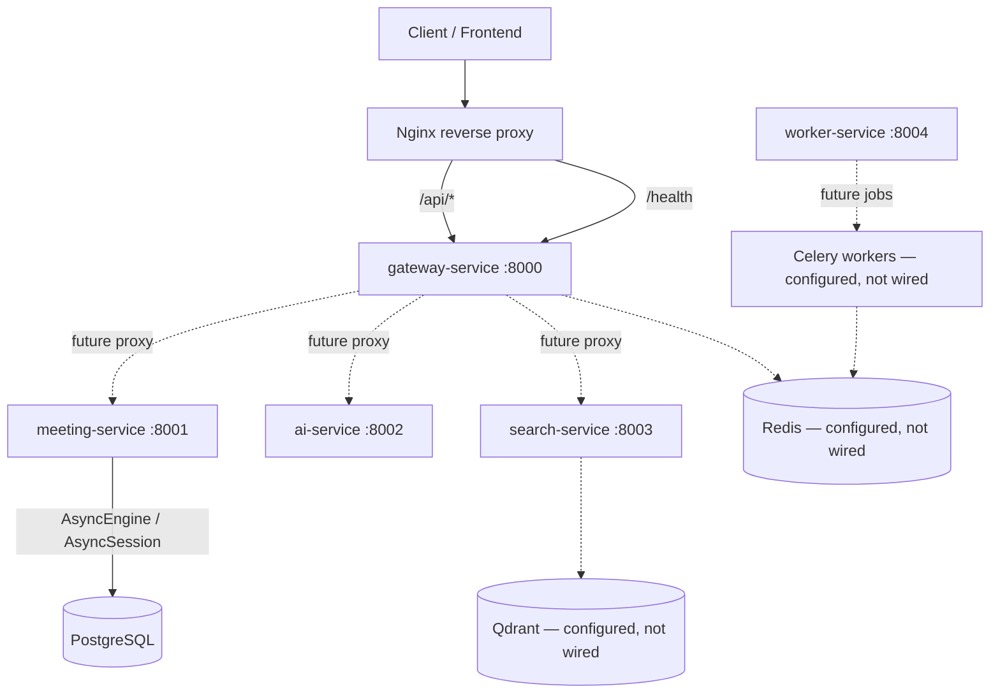

# MannerAI Meetings Platform — Project Foundation

> **Scope:** Architectural foundation completed through **Phase 2.5**  
> **Last updated phase:** Phase 2.5 — PostgreSQL Database Foundation  
> **Maturity:** Production-grade foundation (not a fully production-ready platform)

This document is the authoritative entry point for the completed backend foundation. It describes **what currently exists** in the repository, **why** it exists, **how** the pieces interact, and **what is deliberately deferred**.

Business features (auth, meetings CRUD, AI pipelines, search, workers) are **not** implemented yet.

---

## Completed Phases

| Phase | Name | Status |
|-------|------|--------|
| 2.1 | Configuration Management | Complete |
| 2.2 | Centralized Logging | Complete |
| 2.3 | Exception & Error Handling | Complete |
| 2.4 | API Design & Contract Standardization | Complete |
| 2.5 | PostgreSQL Database Foundation | Complete |
| 2.6 | — | **Not started** |

Phase 2.6 has not been started.

---

## System Architecture



### Implemented foundation

- Five FastAPI microservices with shared bootstrap (logging, exceptions)
- Centralized configuration via Pydantic Settings
- Request correlation (`X-Request-ID`)
- Standardized error envelope
- Gateway public API prefix (`/api/v1`) and OpenAPI customization
- Async SQLAlchemy PostgreSQL infrastructure
- meeting-service PostgreSQL lifespan and readiness probing
- Alembic migration infrastructure (no business revisions yet)

### Planned / deferred integrations

- Business HTTP routes (routers exist as scaffolding only)
- Gateway proxying to internal services
- Authentication and authorization
- Redis client wiring
- Qdrant vector operations
- Celery worker execution
- Docker/deployment hardening (intentionally deferred)
- Frontend integration

Configuration fields and stub modules exist for Redis, Qdrant, and Celery, but they are **not** active application integrations.

---

## Service Responsibilities

| Service | Current responsibility | DB access | Status |
|---------|---------------------|-----------|--------|
| **gateway-service** | Public API entry, OpenAPI, health probes, `/api/v1` router mount point | None | Foundation only |
| **meeting-service** | Health probes, PostgreSQL lifespan, DB readiness | **PostgreSQL (active)** | Foundation + DB owner |
| **ai-service** | Health probes | None | Foundation only |
| **search-service** | Health probes | None | Foundation only |
| **worker-service** | Health probes | None | Foundation only |

**Database ownership principle:** A service gets database access when it owns a persistence responsibility. meeting-service is the first connected service because it will own meeting/transcript persistence. Gateway, AI, search, and worker PostgreSQL access remain deferred.

---

## Shared Module Architecture

```
backend/shared/
├── api/           # API contract constants and OpenAPI helpers
├── config/        # Pydantic Settings base and discovery
├── database/      # SQLAlchemy async infrastructure
├── exceptions/    # AppError hierarchy and FastAPI handlers
├── middleware/    # Request logging middleware
├── schemas/       # Pydantic DTO/API/domain schemas
└── utils/         # Logging, health payloads, service bootstrap
```

### Pydantic schemas vs SQLAlchemy ORM

| Layer | Location | Purpose |
|-------|----------|---------|
| **Pydantic schemas** | `backend/shared/schemas/` | API request/response DTOs, domain data shapes |
| **SQLAlchemy infrastructure** | `backend/shared/database/` | Engine, sessions, Base, mixins, connectivity |

These layers are **separate by design**:

- Pydantic schemas do **not** inherit from SQLAlchemy models
- ORM models must **not** be exposed directly as API `response_model`
- `*Public` schemas (e.g. `MeetingPublic`) exclude internal persistence fields

**Current ORM state:** `DeclarativeBase`, UUID/timestamp mixins, and Alembic metadata exist. **No business ORM model classes or tables** are implemented yet.

---

## Phase 2.1 — Configuration Management

### Implementation

- **Pydantic Settings** (`pydantic-settings`) with typed configuration
- **`SharedSettings`** in `backend/shared/config/base.py` — shared fields for all services
- **Service-specific settings** — each service extends `SharedSettings` (e.g. `GatewaySettings`, `MeetingSettings`)
- **`AppEnv`** enum: `development`, `testing`, `production`
- **Repository-root `.env` discovery** via marker files (`.env.example`, `requirements.txt`)
- **Settings source priority:** init values → environment variables → repository `.env` → file secrets
- **`@lru_cache` factories** — `get_base_settings()`, per-service `get_settings()`
- **`SecretStr`** for sensitive gateway fields (JWT secret, API keys)
- **Production JWT validation** — rejects weak secrets in `AppEnv.PRODUCTION`
- **Service isolation** — `extra="ignore"` allows one `.env` with variables for all services

### Configuration flow

```
Environment / .env
        ↓
Pydantic Settings
        ↓
SharedSettings
        ↓
Service Settings (GatewaySettings, MeetingSettings, …)
        ↓
Application components
```

Application code should **not** use `os.getenv()` directly. All configuration flows through the settings classes.

### Files

- `.env` — local credentials (gitignored)
- `.env.example` — safe development template (committed)

---

## Phase 2.2 — Centralized Logging

### Implementation

| Component | Location | Role |
|-----------|----------|------|
| Logger setup | `shared/utils/logger.py` | `configure_logging()`, `ServiceContextFilter` |
| Context | `shared/utils/logging_context.py` | `contextvars` for request-scoped fields |
| Formatters | `shared/utils/logging_formatters.py` | `DevelopmentFormatter`, `JsonFormatter` |
| Middleware | `shared/middleware/request_logging.py` | Request correlation and access logging |
| Bootstrap | `shared/utils/service_bootstrap.py` | `init_service_logging()`, middleware registration |

### Request logging flow

```
Request
  ↓
RequestLoggingMiddleware
  ↓
request_id (reuse X-Request-ID or generate UUID)
  ↓
contextvars (set_log_context)
  ↓
ServiceContextFilter
  ↓
Formatter (human-readable dev / JSON production)
  ↓
stdout
```

### Key behaviors

- **`X-Request-ID`** — client may supply; invalid values replaced with generated UUID
- **Development/testing** — human-readable log format
- **Production** — JSON structured logs (`APP_ENV=production`)
- **Health endpoints** — silent at INFO in request middleware (no noisy access logs)
- **Secret safety** — `database_url`, JWT secrets, API keys in sensitive-field denylist
- **Uvicorn integration** — loggers configured for uvicorn access/error

Frontend correlation ID propagation is **not** implemented.

---

## Phase 2.3 — Exception & Error Handling

### Separation of concerns

| Layer | Responsibility |
|-------|----------------|
| Application exceptions | Describe what went wrong (`AppError` hierarchy) |
| Exception handlers | Translate to HTTP responses |
| Logging | Record tracebacks and request context |

### Exception hierarchy

```
AppError (base)
├── BadRequestError (400)
├── UnauthorizedError (401)
├── ForbiddenError (403)
├── NotFoundError (404)
├── ConflictError (409)
├── ValidationError (422)
└── ServiceUnavailableError (503)
```

### Handlers (all five services)

Registered via `register_exception_handlers(app)` in `shared/exceptions/handlers.py`:

1. **`AppError`** — uses exception's status, code, message
2. **`RequestValidationError`** — 422 with normalized field details
3. **`StarletteHTTPException`** — backward-compatible `HTTPException` translation
4. **`Exception`** — 500 with safe generic message; full traceback logged server-side

**Starlette 404:** Unmatched routes return the standardized envelope (`NOT_FOUND`), not `{"detail":"Not Found"}`.

### Error envelope

```json
{
  "error": {
    "code": "NOT_FOUND",
    "message": "Resource not found.",
    "request_id": "abc-123",
    "details": []
  }
}
```

Every error response includes `request_id` in the body and `X-Request-ID` header.

Clients never receive: stack traces, database errors, credentials, internal paths, or raw exception messages (for unexpected 500s).

---

## Phase 2.4 — API Design & Contract Standardization

### Public vs internal APIs

| Boundary | URL pattern | Owner |
|----------|-------------|-------|
| **Public API** | `/api/v1/*` | gateway-service |
| **Internal APIs** | unversioned (`/meetings`, `/search`, …) | respective services |
| **Infrastructure** | `/health`, `/health/live`, `/health/ready` | all services (unversioned) |

Gateway is the **public API compatibility boundary**. Internal service APIs evolve with coordinated deploys.

### What is actually mounted

| Component | Status |
|-----------|--------|
| Gateway `api_v1_router` | Mounted at `/api/v1` (empty — no business routes) |
| Gateway business routers (`auth`, `users`, `meetings`, …) | Scaffolded in `app/routes/` — **not mounted** |
| meeting-service routers | Scaffolded — **not mounted** |
| search-service router | Scaffolded at `app/routes/search.py` — **not mounted** |

No fake or 501 placeholder endpoints exist.

### OpenAPI

- Gateway owns the **canonical public OpenAPI** spec
- `info.version` = application version (`0.1.0`)
- `info.x-api-version` = API version (`v1`)
- Shared `ErrorResponse` / `ErrorBody` in OpenAPI components
- `X-Request-ID` documented as optional header
- Health endpoints excluded from public business schema (`include_in_schema=False`)

### Pagination contract

```json
{
  "items": [...],
  "pagination": {
    "page": 1,
    "page_size": 20,
    "total": 100,
    "total_pages": 5
  }
}
```

Defaults: `page=1`, `page_size=20`, max `page_size=100`. Implemented as schemas/utilities only — no list endpoints yet.

### Public schema safety

- `MeetingPublic` excludes `organization_id` and `created_by` (present on `MeetingInDB`)
- `UserPublic` excludes `hashed_password` (present on `UserInDB`)

### Nginx

`infrastructure/nginx/nginx.conf` proxies `/api/` to gateway. Public contract documented as `/api/v1`. Nginx is configured but Docker deployment is deferred.

---

## Phase 2.5 — PostgreSQL Database Foundation

### Architecture

```
FastAPI (meeting-service)
  ↓ lifespan startup/shutdown
AsyncEngine (process-wide, pooled, pool_pre_ping=True)
  ↓
async_sessionmaker
  ↓
AsyncSession (request-scoped via get_db_session)
  ↓
Repository layer (future — stubs exist, NotImplementedError)
  ↓
Service layer (future)
  ↓
PostgreSQL (asyncpg)
```

### Shared database modules

| Module | Purpose |
|--------|---------|
| `base.py` | `DeclarativeBase` — canonical metadata for Alembic |
| `mixins.py` | `UUIDPrimaryKeyMixin`, `TimestampMixin` (TIMESTAMPTZ) |
| `engine.py` | `create_database_engine()`, `dispose_database_engine()` |
| `session.py` | `init_database()`, `close_database()`, `get_db_session()` |
| `health.py` | `check_postgres_connectivity()` — `SELECT 1` probe |
| `postgres.py` | Backward-compatible re-exports |
| `models/__init__.py` | Model registry import point (no business models yet) |

### Engine and session lifecycle

- **Engine:** one per process, created in meeting-service lifespan via `startup_database()`
- **Session factory:** `async_sessionmaker(expire_on_commit=False)`
- **Shutdown:** `close_database()` disposes engine and resets factory
- **Dependency:** `get_db_session()` yields a session; rolls back on exception; does **not** auto-commit

### Connection pooling

| Setting | Default | Source |
|---------|---------|--------|
| `DATABASE_POOL_SIZE` | 10 | `SharedSettings` |
| `DATABASE_MAX_OVERFLOW` | 10 | `SharedSettings` |
| `DATABASE_POOL_TIMEOUT` | 30 | `SharedSettings` |
| `DATABASE_POOL_RECYCLE` | 1800 | `SharedSettings` |
| `DATABASE_ECHO` | false | `SharedSettings` |
| `pool_pre_ping` | true | hardcoded in engine |

### Transaction model

```
Route → Service → Repository → AsyncSession → commit / rollback
```

- Sessions are request/task scoped
- Engine is process-wide
- Repositories should not arbitrarily commit
- Transaction boundaries belong at the service/application layer
- No Unit of Work abstraction exists

Repository stubs (`MeetingRepository`, `TranscriptRepository`) raise `NotImplementedError`.

---

## Health and Readiness

| Endpoint | Purpose | PostgreSQL check? |
|----------|---------|-----------------|
| `/health` | Liveness / general status | No |
| `/health/live` | Process alive | No |
| `/health/ready` | Dependencies available | **Yes — meeting-service only** |

### meeting-service readiness

```
PostgreSQL available
  → SELECT 1 succeeds
  → /health/ready → 200 (health_payload)

PostgreSQL unavailable
  → check_postgres_connectivity() catches SQLAlchemyError / OSError
  → returns False (no unhandled exception)
  → /health/ready → 503 SERVICE_UNAVAILABLE (standardized error envelope)
```

**Failure-path fix (Phase 2.5):** When PostgreSQL is stopped, Windows surfaces `OSError` (e.g. WinError 10061). The connectivity helper catches `(SQLAlchemyError, OSError)` and returns `False` instead of propagating a generic 500.

Other services return static 200 on `/health/ready` — no dependency checks yet.

---

## Alembic / Migrations

```
alembic.ini                    # repository root
backend/migrations/
  env.py                       # async PostgreSQL, Base.metadata
  script.py.mako
  versions/                    # empty (no business revisions)
```

- **One canonical migration system** for the entire platform
- Configuration reads `DATABASE_URL` from `get_base_settings()` — no hardcoded credentials
- Async migration support via `run_async_migrations()`
- **No business ORM models or migration revisions** — first revision comes with feature-phase models

Commands (from repository root):

```bash
alembic -c alembic.ini current
alembic -c alembic.ini upgrade head
```

---

## Database Configuration

| Variable | Purpose |
|----------|---------|
| `DATABASE_URL` | Async PostgreSQL URL (`postgresql+asyncpg://...`) |
| `DATABASE_POOL_SIZE` | Connection pool size |
| `DATABASE_MAX_OVERFLOW` | Extra connections beyond pool |
| `DATABASE_POOL_TIMEOUT` | Seconds to wait for a connection |
| `DATABASE_POOL_RECYCLE` | Connection recycle interval (seconds) |
| `DATABASE_ECHO` | SQLAlchemy SQL echo (development only) |

- **`.env`** — local real credentials (gitignored)
- **`.env.example`** — safe development template (committed)
- Credentials are never logged (`database_url` in sensitive-field denylist)

---

## Testing Strategy

### Test modules

| File | Phase | Focus |
|------|-------|-------|
| `test_config.py` | 2.1 | Settings, env discovery, JWT validation |
| `test_logging.py` | 2.2 | Formatters, request ID, middleware |
| `test_exceptions.py` | 2.3 | Error envelope, handlers, 404 |
| `test_api.py` | 2.4 | API prefix, pagination, OpenAPI, schemas |
| `test_database.py` | 2.5 | Engine, session, Alembic, readiness |

### Current verified count

```
Ran 71 tests — OK (1 skipped)
```

The skipped test is the opt-in PostgreSQL integration test (`RUN_POSTGRES_INTEGRATION=1`).

### Test categories

| Category | Examples |
|----------|----------|
| **Unit tests** | Settings defaults, mixin fields, mocked engine/session, Alembic config source |
| **Integration tests (opt-in)** | Real `SELECT 1` against local PostgreSQL |
| **Service import tests** | All five services import and register handlers |
| **Failure-path tests** | OSError connectivity → False; `/health/ready` → 503 |

Tests do **not** require Docker. PostgreSQL integration is optional.

### Tests passed vs manually verified

Automated tests confirm infrastructure behavior with mocks and imports. Manual verification additionally confirmed:

- Five-service health endpoints
- Gateway OpenAPI metadata
- Request ID in responses and error envelopes
- meeting-service readiness with PostgreSQL running
- meeting-service readiness with PostgreSQL stopped (503, not 500)
- PostgreSQL restoration after restart
- Alembic `current` against local PostgreSQL

---

## Current Repository Structure

```
meeting-summarizer-follow-up-ai-agent/
├── alembic.ini
├── .env.example
├── requirements.txt
├── backend/
│   ├── gateway-service/app/
│   ├── meeting-service/app/
│   ├── ai-service/app/
│   ├── search-service/app/
│   ├── worker-service/app/
│   ├── shared/
│   │   ├── api/
│   │   ├── config/
│   │   ├── database/
│   │   │   ├── base.py, engine.py, session.py, health.py, mixins.py
│   │   │   └── models/
│   │   ├── exceptions/
│   │   ├── middleware/
│   │   ├── schemas/
│   │   └── utils/
│   ├── migrations/
│   │   ├── env.py
│   │   ├── script.py.mako
│   │   └── versions/
│   └── tests/
├── database/postgresql/          # schema documentation (not live migrations)
├── docs/
│   ├── architecture/
│   └── api/
├── infrastructure/nginx/
└── scripts/                      # setup, run-service, start-infra
```

---

## Architectural Decisions

| Decision | Choice | Reason |
|----------|--------|--------|
| Configuration | Pydantic Settings | Typed, validated, testable; no raw `os.getenv()` |
| Env file location | Repository-root `.env` | Single file for all services; CWD-independent discovery |
| Logging | Centralized stdlib + contextvars | No structlog/loguru; request correlation without globals |
| Request correlation | `X-Request-ID` header | Industry standard; echoed on all responses |
| Error format | Standardized JSON envelope | Consistent client contract across all services |
| API versioning | URL `/api/v1` at gateway | Visible, frontend-friendly, nginx-compatible |
| Public/internal split | Gateway owns public API | Compatibility boundary; internal services unversioned |
| Database access | SQLAlchemy 2.x async + asyncpg | Matches FastAPI async model |
| Primary keys | UUID | Distributed-friendly; documented convention |
| Timestamps | TIMESTAMPTZ | Timezone-aware; PostgreSQL-native |
| Engine scope | Process-wide singleton | Connection pooling efficiency |
| Session scope | Request/task scoped | Isolation; no shared session state |
| Transactions | Service-layer ownership | Simple; no premature Unit of Work |
| Migrations | One Alembic at repo root | Single schema; shared metadata |
| Initial DB owner | meeting-service | Owns meeting/transcript persistence |
| Business migrations | Deferred until ORM models | No fake initial migration |
| Docker | Deferred | Local venv development first |
| Success response wrapper | No universal `{data: ...}` | Direct resource responses; envelope only for lists/errors |

---

## Security Principles

### Implemented

- `.env` gitignored; `.env.example` has safe defaults only
- `SecretStr` for JWT and API keys where configured
- Production JWT secret validation (min 32 chars, rejects known weak values)
- Credentials excluded from logs (`database_url`, API keys, JWT, Redis URLs)
- Generic 500 responses — no tracebacks or internal messages to clients
- Request middleware does not log authorization headers, cookies, or bodies
- Readiness failures return safe `SERVICE_UNAVAILABLE` message

### Future security work

- Authentication and authorization
- Rate limiting
- SSL/TLS for PostgreSQL in production
- `database_url` as `SecretStr`
- Gateway upstream error mapping (502/504)
- Multi-tenancy enforcement at query level

---

## Deferred / Not Yet Implemented

- Business ORM models and Alembic revisions
- Business HTTP routes (auth, meetings, search, analytics, integrations)
- Authentication persistence and gateway DB access
- meeting CRUD, transcript storage, upload processing
- AI agents, LLM pipelines, summarization
- Semantic search and vector indexing
- Celery task execution and worker DB strategy
- Redis client wiring (cache, sessions, broker)
- Qdrant vector store operations
- Gateway service-to-service HTTP proxying
- Frontend API clients (scaffolded, throw `NotImplementedError`)
- Docker/deployment production hardening
- Rate limiting, CORS, gateway lifespan (postgres/redis)
- Cursor pagination for search
- Frontend correlation ID propagation

---

## Development Workflow

The project follows this engineering sequence:

1. **Architectural inspection** — read repository, produce findings
2. **Manual architectural decisions** — human review and approval
3. **Cursor implementation** — code changes per approved scope
4. **Automated tests** — unit and integration tests
5. **Local manual verification** — run services, curl endpoints
6. **Failure-path verification** — test degraded states (e.g. PostgreSQL down)
7. **Code review**
8. **Git diff review**
9. **Commit**
10. **Push**
11. **Next phase**

Cursor is an **implementation assistant**, not the source of architectural authority. Architecture is reviewed before implementation.

### Local commands

```powershell
.\scripts\setup.ps1                          # once
.\scripts\run-service.ps1 gateway|meeting|ai|search|worker
curl http://localhost:8001/health/ready      # meeting-service readiness
alembic -c alembic.ini current               # migration state
```

---

## Project Principles

1. Production-grade from the beginning.
2. No starter implementation followed by planned cleanup.
3. Architecture is reviewed before implementation.
4. Cursor does not independently redefine architecture.
5. Infrastructure ownership follows service responsibility.
6. Pydantic schemas and SQLAlchemy ORM models remain separate.
7. Transactions are explicit.
8. Liveness and readiness are different concepts.
9. Failure paths are tested, not just happy paths.
10. Secrets never enter Git or logs.
11. Docker is intentionally deferred until later.
12. Do not implement future phases prematurely.

---

## Documentation Cross-References

| Topic | Document |
|-------|----------|
| Architecture overview | [overview.md](./overview.md) |
| Logging | [logging.md](./logging.md) |
| Exceptions | [exceptions.md](./exceptions.md) |
| API design | [api-design.md](./api-design.md) |
| Database | [database.md](./database.md) |
| PostgreSQL migrations | [../../database/postgresql/migrations.md](../../database/postgresql/migrations.md) |
| Database docs index | [../../docs/database/README.md](../../docs/database/README.md) |
| Public API reference | [../../docs/api/README.md](../../docs/api/README.md) |

Detailed phase documents remain authoritative for their specific topics. This document consolidates and relates them.

---

## Documentation Review Findings

Minor inconsistencies noted (not fixed in this documentation task):

1. **`docs/architecture/overview.md`** still lists "SQLAlchemy ORM models (TODO)" — accurate but now partially superseded by Phase 2.5 infrastructure (Base/mixins exist; business models do not).
2. **Gateway `main.py` TODO** still mentions "lifespan — postgres/redis init" — gateway DB access is deferred; the TODO is aspirational for a future auth phase.
3. **Repository stubs** reference `AsyncSession` but are not wired to routes — documented as future, not current.

No code issues requiring immediate fix were identified during this documentation review.
