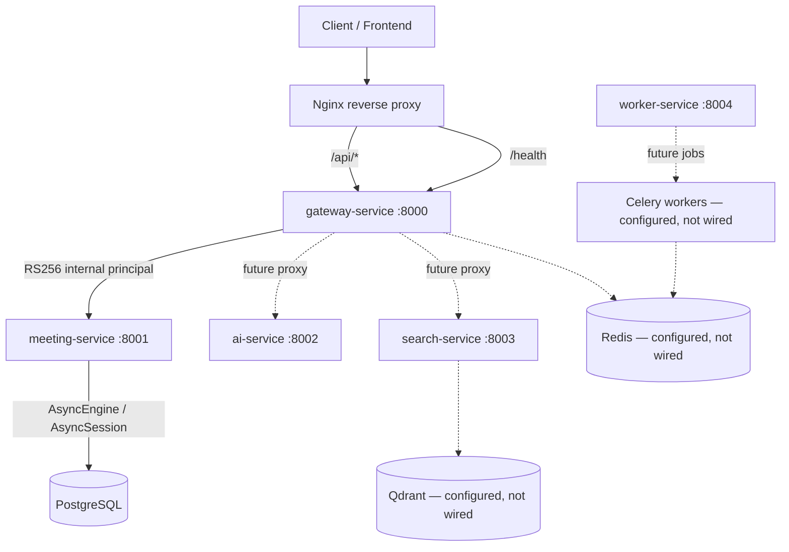

# MannerAI Meetings Platform — Foundation and Current State

> **Current scope:** Phase 0 through **Phase 9.1 Redis/Celery boundary**
> **Current implementation:** Authentication and Meeting Service APIs/persistence, Phase 7 AI processing, Phase 8 process-local job execution, and Phase 9.1 Celery configuration/envelope/task adapters
> **Maturity:** Production-grade foundation plus a bounded persistence slice; not a fully production-ready platform

This is the current reference for implemented architecture. The later
“Phase 2.5 historical snapshot” preserves what was true at that checkpoint;
it must not be read as the current implementation status.

Phase 5 completes the Meeting domain persistence and API slice on top of Phase
4 identity and ownership. PostgreSQL was synchronized through
`0004_meeting_domain_results`; the historical verification evidence is recorded
in the Phase 5 section below. Phase 6 established AI contracts, provider
abstraction, five typed agents, and orchestration. Phase 7 completes the
provider adapter, transcript normalization, structured-output/domain mapping,
MeetingInsight schema and repository boundary, `AIProcessingService`, and
deterministic application-path integration tests. Phase 8 adds a process-local
job submission/execution boundary that delegates to `AIProcessingService`.
Phase 9.1 defines the Celery transport/task boundary; live Redis operation,
trusted worker identity wiring, and durable job state remain deferred.
Revision `0005_meeting_insights` is defined but unapplied. Public AI API
exposure, automatic persistence, search, and frontend integration remain
deferred.

---

## Completed Phases

| Phase | Name | Status |
|-------|------|--------|
| 2.1 | Configuration Management | Complete |
| 2.2 | Centralized Logging | Complete |
| 2.3 | Exception & Error Handling | Complete |
| 2.4 | API Design & Contract Standardization | Complete |
| 2.5 | PostgreSQL Database Foundation | Complete |
| 3.1 | Domain / ORM Modeling | Complete |
| 3.2 | Initial Alembic Migration | Complete and applied locally |
| 3.3 | Repository + Service / Use-Case Layer | Complete |
| 3.4 | Internal Meeting-service Routes | Complete |
| 4 | Authentication & Authorization | Complete |
| 5.1–5.5 | Complete Meeting Domain / Meeting Service MVP | Complete; PostgreSQL synchronized and integration-validated |
| 6.1–6.5 | AI Service Foundation | Complete; provider-independent contracts, agents, orchestration, and hardening |
| 7.1–7.6 | AI Meeting Intelligence Integration | Complete; provider adapter, transcript path, typed mapping, persistence design, application service, and deterministic integration tests |
| 8 | Background Processing Application Boundary | Complete; framework-neutral job contract, executor/submission ports, and process-local FIFO adapter |
| 9.1 | Redis/Celery Infrastructure Boundary | Implemented; JSON-only envelope, Celery app/configuration, submission and task adapters; trusted distributed identity and live Redis remain unavailable |

---

## System Architecture



### Implemented foundation

- Five FastAPI microservices with shared bootstrap (logging, exceptions)
- Centralized configuration via Pydantic Settings
- Request correlation (`X-Request-ID`)
- Standardized error envelope
- Gateway public API prefix (`/api/v1`) and OpenAPI customization
- Gateway signup/login, access JWT authentication, and refresh-session lifecycle
- Current-user profile read and email-only update
- Authenticated Gateway-to-Meeting facade and Meeting ownership enforcement
- Async SQLAlchemy PostgreSQL infrastructure
- meeting-service PostgreSQL lifespan and readiness probing
- Alembic initial domain revision: `0001_meetings_transcripts`
- `Meeting` and `Transcript` ORM models, repositories, and `MeetingService`
- Internal meeting-service `POST /meetings` and `GET /meetings/{meeting_id}` routes
- AI Service processing contracts, injected provider protocol, structured-output validation, and sanitized errors
- Common `Agent` architecture and `SummaryAgent`, `TaskAgent`, `DecisionAgent`, `FollowUpAgent`, and `InsightAgent`
- Sequential operation orchestration with typed results and partial-failure semantics
- Phase 7 transcript-to-domain-input AI processing path; see the Phase 7 section below

### Planned / deferred integrations

- Organization membership and authorization for organization-wide meeting listing
- Redis client wiring
- Qdrant vector operations
- Celery worker execution
- Distributed worker execution and production pipeline/Gateway integration
- Automatic AI-output persistence after mapping
- Applying and PostgreSQL-validating `0005_meeting_insights`
- Public AI processing/job APIs
- Semantic search and vector retrieval
- Docker/deployment hardening (intentionally deferred)
- Frontend integration

Configuration fields and stub modules exist for Redis, Qdrant, and Celery, but they are **not** active application integrations.

---

## Service Responsibilities

| Service | Current responsibility | DB access | Status |
|---------|---------------------|-----------|--------|
| **gateway-service** | Public API, auth/user routes, meeting/result facade, OpenAPI, health probes | **PostgreSQL (users/sessions)** | Phase 4 authentication; Phase 5 public v1 proxies |
| **meeting-service** | Health probes, PostgreSQL lifecycle/readiness, meeting-domain APIs | **PostgreSQL (meetings/transcripts/results)** | Ownership-enforced service and domain persistence |
| **ai-service** | Health probes plus job contracts/executor, `AIProcessingService`, transcript normalization, five agents, provider adapter, typed orchestration and domain mapping | None | Phase 7 path plus Phase 8 process-local job boundary; no persistence or durable queue |
| **search-service** | Health probes | None | Foundation only |
| **worker-service** | Health probes | None | Foundation only |

**Database ownership principle:** A service gets database access when it owns a persistence responsibility. Gateway owns user and refresh-session persistence; Meeting Service owns meetings, transcripts, and persisted domain results, with the MeetingInsight repository boundary defined pending migration 0005. The AI Service returns mapped domain inputs and remains persistence-independent; applying migration 0005 and invoking persistence after AI processing are separate responsibilities. Search and worker PostgreSQL access remain deferred.

---

## Shared Module Architecture

```
backend/shared/
├── api/           # API contract constants and OpenAPI helpers
├── config/        # Pydantic Settings base and discovery
├── database/      # SQLAlchemy async infrastructure
├── exceptions/    # AppError hierarchy and FastAPI handlers
├── middleware/    # Request logging middleware
├── schemas/       # Pydantic DTO/API/domain schemas
└── utils/         # Logging, health payloads, service bootstrap
```

### Pydantic schemas vs SQLAlchemy ORM

| Layer | Location | Purpose |
|-------|----------|---------|
| **Pydantic schemas** | `backend/shared/schemas/` | API request/response DTOs, domain data shapes |
| **SQLAlchemy infrastructure** | `backend/shared/database/` | Engine, sessions, Base, mixins, connectivity |

These layers are **separate by design**:

- Pydantic schemas do **not** inherit from SQLAlchemy models
- ORM models must **not** be exposed directly as API `response_model`
- `*Public` schemas (e.g. `MeetingPublic`) exclude internal persistence fields

**Current ORM state:** `DeclarativeBase`, UUID/timestamp mixins, metadata, and
business models (`Meeting`, `Transcript`) exist. The models are imported through
`shared.database.models` for Alembic metadata discovery; ORM entities remain
separate from public Pydantic response models.

---

## Phase 2.1 — Configuration Management

### Implementation

- **Pydantic Settings** (`pydantic-settings`) with typed configuration
- **`SharedSettings`** in `backend/shared/config/base.py` — shared fields for all services
- **Service-specific settings** — each service extends `SharedSettings` (e.g. `GatewaySettings`, `MeetingSettings`)
- **`AppEnv`** enum: `development`, `testing`, `production`
- **Repository-root `.env` discovery** via marker files (`.env.example`, `requirements.txt`)
- **Settings source priority:** init values → environment variables → repository `.env` → file secrets
- **`@lru_cache` factories** — `get_base_settings()`, per-service `get_settings()`
- **`SecretStr`** for sensitive gateway fields (JWT secret, API keys)
- **Production JWT validation** — rejects weak secrets in `AppEnv.PRODUCTION`
- **Service isolation** — `extra="ignore"` allows one `.env` with variables for all services

### Configuration flow

```
Environment / .env
        ↓
Pydantic Settings
        ↓
SharedSettings
        ↓
Service Settings (GatewaySettings, MeetingSettings, …)
        ↓
Application components
```

Application code should **not** use `os.getenv()` directly. All configuration flows through the settings classes.

### Files

- `.env` — local credentials (gitignored)
- `.env.example` — safe development template (committed)

---

## Phase 2.2 — Centralized Logging

### Implementation

| Component | Location | Role |
|-----------|----------|------|
| Logger setup | `shared/utils/logger.py` | `configure_logging()`, `ServiceContextFilter` |
| Context | `shared/utils/logging_context.py` | `contextvars` for request-scoped fields |
| Formatters | `shared/utils/logging_formatters.py` | `DevelopmentFormatter`, `JsonFormatter` |
| Middleware | `shared/middleware/request_logging.py` | Request correlation and access logging |
| Bootstrap | `shared/utils/service_bootstrap.py` | `init_service_logging()`, middleware registration |

### Request logging flow

```
Request
  ↓
RequestLoggingMiddleware
  ↓
request_id (reuse X-Request-ID or generate UUID)
  ↓
contextvars (set_log_context)
  ↓
ServiceContextFilter
  ↓
Formatter (human-readable dev / JSON production)
  ↓
stdout
```

### Key behaviors

- **`X-Request-ID`** — client may supply; invalid values replaced with generated UUID
- **Development/testing** — human-readable log format
- **Production** — JSON structured logs (`APP_ENV=production`)
- **Health endpoints** — silent at INFO in request middleware (no noisy access logs)
- **Secret safety** — `database_url`, JWT secrets, API keys in sensitive-field denylist
- **Uvicorn integration** — loggers configured for uvicorn access/error

Frontend correlation ID propagation is **not** implemented.

---

## Phase 2.3 — Exception & Error Handling

### Separation of concerns

| Layer | Responsibility |
|-------|----------------|
| Application exceptions | Describe what went wrong (`AppError` hierarchy) |
| Exception handlers | Translate to HTTP responses |
| Logging | Record tracebacks and request context |

### Exception hierarchy

```
AppError (base)
├── BadRequestError (400)
├── UnauthorizedError (401)
├── ForbiddenError (403)
├── NotFoundError (404)
├── ConflictError (409)
├── ValidationError (422)
└── ServiceUnavailableError (503)
```

### Handlers (all five services)

Registered via `register_exception_handlers(app)` in `shared/exceptions/handlers.py`:

1. **`AppError`** — uses exception's status, code, message
2. **`RequestValidationError`** — 422 with normalized field details
3. **`StarletteHTTPException`** — backward-compatible `HTTPException` translation
4. **`Exception`** — 500 with safe generic message; full traceback logged server-side

**Starlette 404:** Unmatched routes return the standardized envelope (`NOT_FOUND`), not `{"detail":"Not Found"}`.

### Error envelope

```json
{
  "error": {
    "code": "NOT_FOUND",
    "message": "Resource not found.",
    "request_id": "abc-123",
    "details": []
  }
}
```

Every error response includes `request_id` in the body and `X-Request-ID` header.

Clients never receive: stack traces, database errors, credentials, internal paths, or raw exception messages (for unexpected 500s).

---

## Phase 2.4 — API Design & Contract Standardization

> Historical checkpoint: this section records Phase 2.4 status. Current route
> mounts and authentication are described in the Phase 4 section above.

### Public vs internal APIs

| Boundary | URL pattern | Owner |
|----------|-------------|-------|
| **Public API** | `/api/v1/*` | gateway-service |
| **Internal APIs** | unversioned (`/meetings`, `/search`, …) | respective services |
| **Infrastructure** | `/health`, `/health/live`, `/health/ready` | all services (unversioned) |

Gateway is the **public API compatibility boundary**. Internal service APIs evolve with coordinated deploys.

### What is actually mounted

| Component | Status |
|-----------|--------|
| Gateway `api_v1_router` | Mounted at `/api/v1` (empty at this checkpoint) |
| Gateway business routers (`auth`, `users`, `meetings`, …) | Scaffolded at this checkpoint — **not mounted** |
| meeting-service routers | Scaffolded at this checkpoint — **not mounted** |
| search-service router | Scaffolded at `app/routes/search.py` — **not mounted** |

No fake or 501 placeholder endpoints exist.

### OpenAPI

- Gateway owns the **canonical public OpenAPI** spec
- `info.version` = application version (`0.1.0`)
- `info.x-api-version` = API version (`v1`)
- Shared `ErrorResponse` / `ErrorBody` in OpenAPI components
- `X-Request-ID` documented as optional header
- Health endpoints excluded from public business schema (`include_in_schema=False`)

### Pagination contract

```json
{
  "items": [...],
  "pagination": {
    "page": 1,
    "page_size": 20,
    "total": 100,
    "total_pages": 5
  }
}
```

Defaults: `page=1`, `page_size=20`, max `page_size=100`. Implemented as schemas/utilities only — no list endpoints yet.

### Public schema safety

- `MeetingPublic` excludes `organization_id` and `created_by` (present on `MeetingInDB`)
- `UserPublic` excludes `password_hash` (present on `UserInDB`)

### Nginx

`infrastructure/nginx/nginx.conf` proxies `/api/` to gateway. Public contract documented as `/api/v1`. Nginx is configured but Docker deployment is deferred.

---

## Phase 4 current authentication and authorization architecture

### User authentication and self-service

`User` persistence stores a unique canonical email and a password hash. Signup
does not create an authenticated session. Login verifies the password and
returns a signed access JWT plus an opaque refresh token. Passwords are hashed
with Passlib `pbkdf2_sha256`; unknown or malformed stored hashes fail as
authentication failures. Duplicate-email races are translated to a conflict
only when the named unique-email constraint caused the `IntegrityError`.

The access JWT carries `sub` (user UUID), `type=access`, `iat`, and `exp`, and is
signed with the configured HS256 key. `get_current_user()` verifies signature
and expiry, requires the access type and UUID subject, and loads the persisted
user. Missing credentials, invalid/expired tokens, unknown users, and bad
passwords use generic 401 semantics. `/api/v1/auth/me` and `/api/v1/users/me`
return `UserPublic`; `PATCH /api/v1/users/me` accepts email only. Extra fields,
including `password` and `password_hash`, are forbidden. The user repository
performs persistence, `UserService` coordinates profile changes and commits,
and escaping exceptions are rolled back by the session dependency.

### Gateway-to-Meeting trust boundary

```text
External client → Gateway: access JWT
Gateway: verify JWT + resolve persisted user
Gateway → Meeting Service: short-lived RS256 internal principal
Meeting Service: verify principal using Gateway public key
```

The internal principal includes `sub`, `type=internal_principal`, `iss`, `aud`,
`iat`, and `exp`. The Gateway signs with its private key; Meeting Service only
receives the matching public key. Meeting does not trust caller-supplied user
IDs and does not validate the external JWT: only the Gateway owns that public
authentication contract and can translate an authenticated identity into a
service-specific assertion. Docker Compose was corrected to pass the private
key only to Gateway and the public key only to Meeting; Meeting no longer gets
the shared `.env` file that could distribute the private key to it. Its port is
internal (`expose`) rather than host-published.

### Meeting ownership and list-route boundary

Gateway derives user identity from `get_current_user()` and passes it to the
Meeting client; the client signs it into the internal principal. Meeting
Service stores the asserted UUID as `created_by`. `MeetingService` checks that
owner before reading/updating an individual meeting or creating, reading, or
replacing its transcript. A non-owner receives a forbidden response. Client
payloads cannot set `created_by` and do not determine authenticated ownership.

The internal `GET /meetings?organization_id=...` list route intentionally
remains without internal-principal or organization-membership authorization.
There is no organization membership model yet; this route is internal-only and
not an authorization boundary for clients. The public Gateway facade currently
does not expose that list operation.

### Refresh-token and session lifecycle

Each login creates an independent `RefreshSession`. Refresh tokens are opaque
384-bit random values generated with Python's `secrets` module; only
`SHA-256(token)` is persisted. The default session lifetime is 30 days, bounded
by configuration. Refresh validates the hash, session state, expiration, and
associated user; then it revokes the old session, creates a replacement, and
commits the rotation transaction. The repository selects the row with
`FOR UPDATE`, serializing concurrent refresh attempts for the same token under
PostgreSQL. Logout revokes only the submitted session. Invalid/revoked/expired
tokens use a generic authentication failure. Access JWTs are not refresh tokens
and are not revoked by logout; they remain valid until expiration.

Migration `0002_users` adds users; `0003_refresh_sessions` adds refresh-session
storage after it. The code migration head is `0003_refresh_sessions`. During the
security-testing checkpoint, the configured database still reported revision
`0001_meetings_transcripts`, so database-backed lifecycle, concurrency, and
rollback tests remained skipped rather than running against an outdated schema.

### Phase 4 security verification

Normal verification reported **50 focused security tests: 44 passed, 6 skipped**
and **209 full backend tests: 202 passed, 7 skipped**. The skipped tests are
opt-in PostgreSQL tests guarded by `RUN_POSTGRES_INTEGRATION=1`. The six new
refresh-session persistence, rotation/reuse, logout, multi-session, concurrency,
and rollback tests were added but not executed because the database lacked the
Phase 4 schema. Unit tests cover token generation/storage, service-level
rotation and validation, authentication dependencies, user self-service,
Meeting ownership, and internal-principal validation. Concurrency and
rotation-rollback did not yet have executed PostgreSQL integration evidence at
the Phase 4 checkpoint. See the Phase 5 validation below for the completed
database run.

## Phase 5 — Complete Meeting Domain / Meeting Service MVP

Phase 5 Blocks 1–5 are complete. The Meeting Service owns this domain flow:

```text
Client → Gateway → Meeting Service route → domain service
       → repository → AsyncSession → PostgreSQL
```

Routes validate request/response contracts, extract the signed internal user
identity, and invoke services. Services enforce ownership, coordinate domain
use cases, map ORM entities to Pydantic DTOs, and commit successful writes.
Repositories perform SQLAlchemy persistence/query operations and `flush()`;
they do not commit or roll back. The request-scoped session dependency rolls
back when an exception escapes. ORM models describe persistence, repositories
return ORM entities, services map them, and API schemas define client-facing
requests/responses.

### Completed domain and relationships

- **User:** authentication identity with assigned Tasks; Organization membership
  is not implemented.
- **Meeting:** aggregate root with one optional Transcript and zero or many
  Summary versions, Tasks, Decisions, and FollowUp drafts.
- **Transcript:** one per Meeting (`meeting_id` unique); Meeting deletion
  cascades to it.
- **Summary:** zero or many per Meeting; positive version, default `1`, and
  unique `(meeting_id, version)`; the latest-version lookup orders by version
  descending. The service accepts an explicit version, but the current HTTP
  create route always uses version `1` because its request has no version field.
- **Task:** belongs to one Meeting and may reference one User as assignee;
  deleting its Meeting cascades, while deleting its assignee sets
  `assignee_id` to `NULL`.
- **Decision** and **FollowUp:** each belongs to one Meeting; Meeting deletion
  cascades to these records.

Revision `0004_meeting_domain_results` adds Summary, Task, Decision, and FollowUp
tables, native Task/FollowUp status enums, uniqueness/check constraints, foreign
keys, and indexes. `ix_summaries_meeting_version_desc`, the unique
`uq_summaries_meeting_version`, Task meeting/status and assignee/status indexes,
and meeting indexes on Decision and FollowUp support the implemented queries.
Migration `0004` follows `0003_refresh_sessions`; the chain is linear:
`0001_meetings_transcripts → 0002_users → 0003_refresh_sessions →
0004_meeting_domain_results`.

### Repository and service behavior

The Summary, Task, Decision, and FollowUp repositories provide create/get/list
operations; Task and FollowUp also provide update. Repositories use
`AsyncSession.execute()` with SQLAlchemy `select()` and deterministic ordering:
Summary versions ascending (latest lookup descending), Tasks and FollowUps by
`created_at DESC, id DESC`, and Decisions by `created_at ASC, id ASC`. Lists
apply their supported status filters in the query. Services serialize scalar
fields into DTOs and do not traverse ORM relationships for response data; this
avoids implicit async lazy-loading and relationship-driven N+1 queries.

`MeetingService.require_owned_meeting()` is the canonical ownership primitive.
Each domain service authorizes the Meeting before create/list; reads and
updates by result ID load the result, resolve its Meeting, and authorize that
Meeting before returning or changing it. Task and FollowUp updates apply only
provided fields; Meeting association is immutable. Summary service version
assignment is explicit (default `1`) and is not automatically incremented; the
current HTTP create route exposes only the default, so later versions cannot
yet be created through the API.

### API and Gateway surface

Meeting Service exposes internal nested routes; Gateway exposes their public
`/api/v1` proxies. Gateway validates the external access token, derives user
identity, and forwards a signed internal principal plus `X-Request-ID`. Create
requests omit the parent Meeting ID so clients cannot override route ownership.
Result ID operations verify both Meeting ownership and URL-parent consistency.
Lists use shared `PaginationParams`/`PaginatedResponse`; Task and FollowUp lists
support `?status=`.

| Resource | Implemented operations |
|----------|-----------------------|
| Summary | `POST`, paginated `GET`, `GET /latest`, `GET /{summary_id}` |
| Task | `POST`, paginated/status-filtered `GET`, `GET /{task_id}`, `PATCH /{task_id}` |
| Decision | `POST`, paginated `GET`, `GET /{decision_id}` |
| FollowUp | `POST`, paginated/status-filtered `GET`, `GET /{followup_id}`, `PATCH /{followup_id}` |

The public organization-wide Meeting list remains deferred. There is no
persisted Organization or membership model; `organization_id` and `created_by`
are UUIDs without foreign keys and do not establish membership authorization.
A safe public list requires persisted user-to-organization membership and a
downstream authorization policy. Phase 5 also defines no searchable or
client-sortable Meeting fields. The internal list remains deterministic by
`created_at DESC, id DESC`; no search infrastructure or client-selected sort
was added.

MeetingInsight remains deferred because its persisted shape, row cardinality,
and lifecycle/version semantics are undefined. No AI generation, workers,
vector search, or Phase 6 functionality is included in Phase 5.

### PostgreSQL synchronization and verification

The configured local development database was at `0001_meetings_transcripts`.
After verifying it was the project-local development database, `alembic upgrade
head` applied revisions `0002` through `0004`. Final `alembic current` reports
`0004_meeting_domain_results (head)` and `alembic check` reports no pending
upgrade operations. PostgreSQL integration tests verified persistence and
retrieval for the Meeting/Transcript/result rows, Summary uniqueness and latest
ordering, Task/FollowUp status filters, task assignee `ON DELETE SET NULL`, and
Meeting-child `ON DELETE CASCADE`.

Final Phase 5 verification used the project `.venv`: **7 PostgreSQL integration
tests passed**, **86 focused Phase 5/API tests passed**, **140 security
regression tests passed**, and the **full backend suite passed 259 tests** with
`RUN_POSTGRES_INTEGRATION=1`. `git diff --check` passed.

PostgreSQL exposed one issue not covered by mocked unit tests: the asyncpg /
SQLAlchemy uniqueness exception wrapper did not expose the Summary constraint
name at the location originally inspected. `SummaryService` now inspects the
wrapped exception causes/diagnostics and maps the duplicate
`(meeting_id, version)` constraint to `ConflictError`. The live integration test
confirmed the behavior.

## Phase 6 — AI Service Foundation (historical checkpoint)

Phase 6 Blocks 1–5 establish a provider-independent AI Service foundation in
`backend/ai-service/`. The AI Service accepts caller-supplied transcript input
and returns typed candidate results. It is not currently invoked through a
Gateway processing route and does not persist results. The Meeting Service
continues to own ORM models, repositories, and database writes.

### Contracts and provider boundary

`ProcessingRequest` carries `meeting_id`, `transcript_id`, a non-empty list of
requested operations, and optional context. Its operation list is deduplicated
while preserving first-request order. `AgentInput` carries the meeting ID,
caller-supplied `TranscriptContent` (transcript ID, optional language, and
ordered segments), and optional meeting context. The orchestrator rejects
meeting or transcript ID mismatches before calling a provider.

At the end of Phase 6, the `ModelProvider` protocol accepted a provider-neutral `ModelRequest` and
returns a `ModelResponse`. Agents receive the provider through dependency
injection and use the shared `generate_structured_output()` boundary, which
adds the selected output model's JSON schema and validates returned JSON with
Pydantic. The error taxonomy covers unavailable, unconfigured, timeout,
rejected, malformed, and unexpected failures with sanitized messages. At that
checkpoint no concrete provider client was implemented; Phase 7 adds the
OpenAI adapter described below.

### Common Agent architecture and output contracts

All agents implement the common `Agent` abstraction, declare a controlled
`AgentKind` and typed output model, build a provider-neutral request from
`AgentInput`, and use shared structured-output validation. Their Pydantic
outputs forbid extra fields and do not contain persistence IDs or lifecycle
metadata. Meeting and transcript IDs remain application-controlled: the
orchestrator checks the caller's IDs and `ProcessingResult` carries them
separately from model output.

| Agent | Output contract and boundary |
|-------|------------------------------|
| `SummaryAgent` | `content` and `key_topics`; transcript-grounded summary data, without persistence metadata |
| `TaskAgent` | A possibly empty list of task candidates with `title`, optional `description`, transcript-level optional `assignee_name`, and optional explicit, unambiguous calendar `due_date`; no user-ID resolution or lifecycle status |
| `DecisionAgent` | `statement`, optional `context`, and participant names; distinguishes resolved decisions from proposals, questions, and unresolved discussion |
| `FollowUpAgent` | Draft `subject`, `body_html`, and recipients with transcript-level name and/or validated email; no status, scheduling, sending, or user-ID resolution |
| `InsightAgent` | Controlled category (`risk`, `blocker`, `concern`, `opportunity`, `dependency`, `unresolved`, `disagreement`, or `observation`), `title`, and `description`; conservative and transcript-grounded, without MeetingInsight persistence fields |

At the Phase 6 checkpoint, `MeetingInsight` persistence was not defined. Phase 7
adds its schema and repository boundary, documented below. Agent output
contracts remain distinct from Meeting Service domain DTOs and ORM models.

### Transcript source-data boundary

Agent requests serialize transcript ID, language, and segment index, speaker,
text, and timestamps as deterministic JSON while preserving caller segment
order. The transcript is labeled and instructed as untrusted source material;
embedded transcript commands must not override the agent's task. Prompts also
direct agents to avoid invented facts and unsupported names, deadlines,
recipients, decisions, and claims, and to preserve uncertainty. Typed schema
validation enforces field shape and types, not semantic truth. Prompts and
schemas do not guarantee immunity to prompt injection or hallucination.

### Orchestration and failure semantics

The orchestrator maps `summary` to `SummaryAgent`, `tasks` to `TaskAgent`,
`decisions` to `DecisionAgent`, `follow_ups` to `FollowUpAgent`, and `insights`
to `InsightAgent`. It processes operations sequentially in request order.
Duplicate operations are removed while preserving the first occurrence. Each
successful operation keeps its concrete typed output; an operation failure is
represented separately with a safe error code and message. `ProcessingResult`
preserves the caller's meeting and transcript IDs and reports `completed` when
all operations succeed,
`partially_failed` when only some succeed, and `failed` when all fail. This
orchestration does not retry, run operations concurrently, call another agent,
or persist any result.

### Phase 6 hardening finding

During the Block 5 adversarial review, `ProcessingRequest` already deduplicated
requested operations, but `ProcessingResult` could still be directly
constructed with duplicate operations and matching duplicate outcomes. The
result contract now rejects duplicate requested operations, with regression
coverage in `test_ai_orchestration.py`. This keeps the aggregate contract
consistent even when it is constructed outside the orchestrator.

### Phase 6 validation evidence

Using the project `.venv`, the final Phase 6 validation reported:

- AI-specific tests: **91 passed**.
- Relevant Meeting/domain/Gateway/database regressions: **68 run, 1 skipped; passed**.
- Full backend suite: **350 run, 8 skipped; passed**.
- PostgreSQL integration modules: **7 skipped** because
  `RUN_POSTGRES_INTEGRATION` was not enabled; no PostgreSQL integration tests
  ran in this validation.
- `python -m pip check`: **No broken requirements found**.
- `git diff --check`: **passed**.

The skipped PostgreSQL checks are opt-in integration tests and are not counted
as passing database evidence. The Phase 6 validation did not apply migrations.

### Deferred after the Phase 6 checkpoint (historical list)

- A concrete `ModelProvider` implementation and provider-specific integration
  were deferred at this checkpoint; Phase 7 has since added the OpenAI adapter.
- AI-output mapping, MeetingInsight persistence, and the processing service
  were deferred at this checkpoint; Phase 7 has since added these boundaries.
- Background processing and Redis/Celery integration.
- Production pipeline and Gateway integration, semantic search, and frontend
  integration.
- Docker/infrastructure work and later roadmap phases.

## Phase 7 — AI Meeting Intelligence Integration (complete)

Phase 7.1–7.6 connects the existing typed agent foundation to a concrete
provider adapter, caller-supplied transcript input, domain mapping, and a
deterministic application-path test suite. Completion means this in-process
application boundary is implemented and tested. It does not mean that the
Gateway exposes AI processing, that requests run as background jobs, or that
successful mapped values are automatically persisted.

| Block | Implemented boundary |
|-------|----------------------|
| 7.1 Real Model Provider | Provider-neutral `ModelProvider` protocol plus an injected OpenAI adapter. Deterministic tests do not use OpenAI or make network calls. |
| 7.2 Transcript Processing Integration | `TranscriptInDB` is normalized into provider-neutral `AgentInput`; segment ordering, speaker, text, timestamps, language, and trusted IDs are preserved/validated. Agents do not retrieve transcripts from a database. |
| 7.3 AI Output Validation & Domain Mapping | Shared structured JSON/Pydantic validation and explicit mappings from all five typed agent outputs to existing domain input schemas. Mapping errors are isolated per operation. |
| 7.4 MeetingInsight Persistence | Shared `InsightCategory`, `MeetingInsight` ORM/schema, Meeting relationship, meeting-scoped repository, and reversible Alembic revision `0005_meeting_insights`. Migration is defined but unapplied and not PostgreSQL-validated. |
| 7.5 AI Processing Service Contract | `AIProcessingService` coordinates transcript normalization, one orchestrator call, identity checks, output mapping, ordered typed results, and safe operation-level failure aggregation. It has no persistence/session/repository dependency. |
| 7.6 AI Integration Testing | Test-only deterministic `ModelProvider` exercises the real service → orchestrator → agents → structured validation → domain mapping path with success, empty, malformed, partial-failure, identity, transcript-preservation, and no-persistence scenarios. |

### Current AI application flow

```text
ProcessingRequest + caller-loaded TranscriptInDB
  → transcript normalization → AgentInput
  → AIProcessingService → AIProcessingOrchestrator
  → SummaryAgent / TaskAgent / DecisionAgent / FollowUpAgent / InsightAgent
  → injected ModelProvider (OpenAI adapter available; no public pipeline wiring)
  → structured JSON validation into typed AI outputs
  → domain mapping into domain-ready Pydantic inputs
  → caller-owned decision about invoking domain persistence
```

The agents are persistence-agnostic. They receive normalized application data,
construct provider-neutral requests, and return typed output models that do not
contain persistence IDs or lifecycle metadata. The application request supplies
trusted meeting/transcript identities; the service and orchestrator validate
those identities and mappers use the trusted meeting ID. Schema validation
checks structure and controlled fields but cannot guarantee semantic grounding.

The operation order is request order; duplicate requests are deduplicated at
request construction while preserving first occurrence. Each operation returns
a typed success or a sanitized failure. Aggregate status is `completed`,
`partially_failed`, or `failed`; a failed operation does not erase other
successes. There is no retry, concurrency, or persistence side effect in this
service boundary.

### Domain mapping limits and insight lifecycle

- Task candidates may include a calendar `due_date`, but the current Task
  domain requires a datetime `due_at`; the mapper does not invent a time or
  timezone. Transcript assignee names are not resolved into User UUIDs.
- Follow-up candidates may identify recipient names, but the current domain
  requires email addresses; the mapper does not infer addresses.
- Insight categories use the shared `InsightCategory` enum. Typed schemas do
  not mathematically guarantee that claims are grounded in the transcript.
- MeetingInsight rows are immutable snapshots with UUID `id`, `meeting_id`,
  `category`, `title`, `description`, and `created_at`. Meeting deletion
  cascades through the FK and ORM `delete-orphan` relationship. There is no
  `updated_at`, status, version, processing run ID, provider metadata, or
  semantic deduplication/replacement policy; similar results may coexist.
- The migration and repository are defined, but revision `0005_meeting_insights`
  is not applied or validated against PostgreSQL. AIProcessingService does not
  call the repository or commit results.

### Phase 7 validation evidence

The Phase 7.6 validation used the repository virtual environment and a
test-only deterministic provider:

- Full backend suite: **422 tests run, 8 skipped; all non-skipped tests passed**.
- AI tests: **153 passed**; domain mapping: **10 passed**; processing service:
  **14 passed**; MeetingInsight persistence unit tests: **10 passed**.
- Meeting domain: **41 passed**; transcript routes: **11 passed**; meeting
  routes: **22 passed**.
- `pip check`: **No broken requirements found**.
- `git diff --check`: **passed**.
- The 8 skips are opt-in tests; these results do not represent PostgreSQL
  validation of MeetingInsight or application of migration 0005.

### Deferred at the end of Phase 7 (historical checkpoint)

- Applying and validating `0005_meeting_insights` against a suitable PostgreSQL
  database.
- An insight domain service and explicit application flow from mapped AI output
  into MeetingInsight persistence.
- Public/internal processing APIs, Gateway pipeline integration, background
  jobs, Redis/Celery execution, retries, and idempotency.
- Semantic insight deduplication/replacement, search/Qdrant/RAG, analytics,
  frontend AI workflow, Gmail delivery, and production deployment.

## Phase 8 — Background Processing Application Boundary

Phase 8 adds typed background-job contracts and separates submission from
execution without coupling the AI application layer to HTTP, Celery, Redis, or
database job storage.

```text
JobSubmissionPort → AIProcessingJob (queued)
                          ↓ explicit in-process dispatch
                   JobExecutorService
                          ↓ transcript resolver
                   AIProcessingService
                          ↓
           existing orchestrator / agents / mapper
```

`AIProcessingJob` carries a generated/stable job UUID, meeting and transcript
UUIDs, requested operations, optional processing context, timezone-aware
timestamps, controlled status, and optional safe failure/result metadata.
Operation duplicates are normalized using the existing first-occurrence
ordering semantics. The job snapshot enforces allowed transitions:

- `queued → running → completed`
- `queued/running → failed`
- `running → partially_failed`

The terminal status follows `AIProcessingResult`: complete success maps to
`completed`, mixed operation outcomes to `partially_failed`, and total failure
to `failed`. Invalid job/transcript input, AI processing failure, domain mapping
failure, and unexpected execution failure have distinct sanitized job-level
codes. Operation-level error detail remains in the typed `AIProcessingResult`.

`AIProcessingJobExecutorService` resolves the transcript through the injected
`TranscriptInputProvider` port, validates both meeting and transcript identity,
rebuilds the existing `ProcessingRequest`, and invokes `AIProcessingService`
once. The shared Phase 7 normalizer preserves canonical segment order, speaker,
timestamps, language, and job identity. The direct service call remains
available, and the executor contains no provider/agent logic or persistence
dependency. Agents, orchestrator, and model provider remain database-unaware
and receive no authentication context.

Gateway's trusted execution-context dependency is downstream of
`get_current_user()`: it accepts the persisted `User` row returned after token
validation and issues a frozen context containing only the authenticated user
UUID and an opaque binding ID. `AIProcessingJob.from_authenticated_context()`
binds both the context ID and principal UUID to the job, so changing either
after construction is rejected; there is no arbitrary job `user_id` field or
public request schema for this internal context. The executor passes the bound
context to the Meeting Service transcript provider. That provider calls
`MeetingService.get_transcript` with the context user UUID, so the existing
`require_owned_meeting()` remains the authority for access. It also checks the
requested transcript ID. Missing context fails safely; a changed context
binding is rejected before resolution; a wrong principal reaches the existing
ownership check and never reaches AI. No new token format or AI-side JWT
validation is introduced; existing Gateway-signed internal principals remain
the mechanism for internal HTTP calls.

Security invariant: **Background execution must preserve the authenticated
principal established by the trusted application boundary; it must never
derive authorization identity from arbitrary job payload data.** No access or
refresh tokens, passwords, password hashes, or provider credentials are
carried in the context/job. Results are not automatically persisted.

`InProcessJobSubmissionPort` is a development/test FIFO queue backed by
`asyncio.Queue`; submission returns a queued receipt and a caller explicitly
dispatches work with `run_next()` to the same job executor. It is not a
distributed worker system. Jobs and outcomes are not durably stored; pending
jobs are lost at process exit.
This process-local adapter does not guarantee durable jobs, retries,
at-least-once or exactly-once delivery, crash recovery, distributed locking,
queue persistence, worker concurrency, or dead-letter handling. Pending jobs
disappear on process exit. AI results remain return values and are not
automatically persisted. Phase 9.1 defines the Celery transport/task boundary
below; live broker operation and trusted worker runtime wiring remain deferred.

The Phase 9 queue/worker contract must preserve these assumptions:

1. Authenticate the trusted queue producer.
2. Transport only an explicitly defined job envelope.
3. Authenticate and validate each message before execution.
4. Obtain or reconstruct a trusted execution context through a controlled
   mechanism after message authentication.
5. Never trust arbitrary `user_id` data from an untrusted producer or accept
   client credentials as authorization authority.
6. Invoke this same `AIProcessingJobExecutorService`.
7. Preserve current job lifecycle and sanitized error semantics.
8. Keep authentication and authorization out of AI services, orchestrators,
   and agents.

The context issuance marker is process-local and is not a serialized
credential. Phase 9 must establish producer authenticity before creating a
trusted worker context. It must not add the deferred delivery, persistence,
recovery, locking, concurrency, or dead-letter guarantees without separately
designing and validating them.

## Phase 9.1 — Redis/Celery Infrastructure Boundary

Phase 9.1 adds the transport and worker infrastructure boundary without moving
business behavior out of the Phase 8 executor:

```text
CeleryJobSubmissionPort
  → JSON AIProcessingJobEnvelope
  → Redis broker (configured, not locally available/validated)
  → Celery task validation
  → trusted worker runtime hook (not configured yet)
  → AIProcessingJobExecutorService
  → MeetingService / AIProcessingService / existing agents
```

`WorkerSettings` reads the broker URL from `CELERY_BROKER_URL`; development
defaults to `redis://localhost:6379/1`. The broker URL is validated as Redis or
TLS Redis. Task and result serialization are JSON-only, accepted content is
JSON-only, and timezone is UTC. Worker concurrency and prefetch default to one.
Tasks acknowledge before execution (`task_acks_late=false`) and do not enable
worker-loss redelivery. These conservative settings do not provide durable or
exactly-once semantics.

No Celery result backend is configured. Celery is the delivery/orchestration
mechanism; the executor's `AIProcessingJob` lifecycle and `AIProcessingResult`
remain the application semantics. Task state is not substituted for business
status, and no result persistence/status API is added.

`AIProcessingJobEnvelope` has exactly four fields: job ID, meeting ID,
transcript ID, and requested operation names. Pydantic strict validation
rejects malformed UUIDs, empty/unknown operations, and unexpected fields.
The Celery adapter sends this primitive JSON payload using the job UUID as the
Celery task ID. It does not serialize a Python job object,
`TrustedExecutionContext`, `user_id`, tokens, ORM/session data, or AI results.
Free-form Phase 8 processing context is not included; Celery submission
rejects jobs with that field set rather than silently changing their input.

The Celery task validates the payload before execution. Worker identity and
executor construction are supplied through an explicit runtime hook. No
runtime is configured by default, because this repository does not yet have an
authenticated producer-to-worker identity mechanism. The task therefore fails
closed instead of reconstructing `TrustedExecutionContext` from a message or
trusting a payload `user_id`. When configured in a future increment, the hook
must return a context issued by the trusted authenticated boundary, construct
the existing Phase 8 job contract, and invoke the same
`AIProcessingJobExecutorService`. The task itself has no AI agent or provider
logic.

Celery 5.4 and Redis client 5.2.1 are already pinned in root
`requirements.txt`; there are no dependency changes. Redis is not installed or
running in this Windows environment. Validation covers configuration, JSON
envelope behavior, mocked queue dispatch, and fail-closed task behavior only;
no live Redis/Celery integration is claimed. Phase 8 process-local FIFO
execution remains available.

## Phase 3 persistence architecture (historical baseline)

### Domain model and schema

`Meeting` and `Transcript` inherit `UUIDPrimaryKeyMixin` and `TimestampMixin`,
giving UUID primary keys and timezone-aware `created_at`/`updated_at` columns.
`participants` and `segments` are PostgreSQL `JSONB`. `MeetingStatus` persists
the lowercase native PostgreSQL enum values `pending`, `processing`, `ready`,
and `failed` through `values_callable`, rather than the uppercase Python member
names. A meeting has at most one transcript; `transcripts.meeting_id` is unique
and has a PostgreSQL foreign key with `ON DELETE CASCADE`. ORM-side
`delete-orphan` mirrors that aggregate ownership.

`organization_id` and `created_by` are required UUID ownership fields, not
foreign keys: user and organization models do not exist yet. This is acceptable
for the current bounded domain, but future user/organization ownership requires
models, migrations, and foreign-key decisions.

### Revision and verification

`backend/migrations/versions/0001_create_meetings_and_transcripts.py` created
the enum, `meetings`, `transcripts`, indexes
`ix_meetings_organization_id`, `ix_meetings_created_by`, and
`ix_transcripts_meeting_id`. Its downgrade reverses dependencies. The local
database was checked empty before application, then schema-verified after the
migration. The applied revision is `0001_meetings_transcripts`.

### Repositories and service/use cases

`MeetingRepository` provides `create`, `get_by_id`, `list_by_organization`, and
`update_status`; `TranscriptRepository` provides `get_by_meeting_id`, `create`,
and `replace_for_meeting`. They accept UUIDs/ORM entities, use `select`,
`AsyncSession.execute`, `add`, and `flush`, and return ORM entities. They never
commit, rollback, return DTOs, or apply business decisions.

`MeetingService` is the Pydantic/ORM boundary. It validates string UUIDs,
converts status values and transcript segments, enforces missing/duplicate
semantics, maps ORM entities to DTOs, and commits successful writes exactly once.
Reads do not commit. If an exception propagates, `get_db_session()` performs the
rollback; the service intentionally does not call rollback itself. This supports
future multi-repository use cases in one transaction.

Current use cases: `create_meeting`, `get_meeting`, `list_meetings`,
`update_meeting_status`, `create_transcript`, `get_transcript`, and
`replace_transcript`. No status-transition graph and no PostgreSQL upsert have
been introduced. Creating a transcript requires an existing meeting and no
existing transcript; replacement requires an existing transcript and never
creates one.

### Explicit DTO/ORM mapping and errors

Pydantic types remain API/domain contracts and SQLAlchemy types remain
persistence models. The service maps explicitly rather than using
`from_attributes=True`: strings become `uuid.UUID`, schema status values become
ORM status values, and `TranscriptSegment.model_dump()` produces JSON-ready
dictionaries; the reverse mapping converts UUIDs to strings and enum values back
to the schema enum. `ValidationError` represents invalid UUID input,
`NotFoundError` represents missing meetings/transcripts, and `ConflictError`
represents duplicate transcripts. Unexpected persistence errors propagate for
the registered boundary handlers rather than exposing raw database errors.

### Deferred decisions

- ORM `Transcript.language` is nullable but `TranscriptInDB.language` is not.
  The service currently normalizes a stored `NULL` to `"en"`; that is valid at
  the DTO boundary but not lossless. Decide later whether the DTO becomes
  nullable or the database becomes non-null with a default.
- ORM and Pydantic each define `MeetingStatus`; their values are mapped
  explicitly. Consolidating enum ownership is a future design decision.
- Routes are not wired, so these use cases are not yet public/internal HTTP APIs.

## Phase 2.5 historical snapshot

The following section records the end-of-Phase-2.5 foundation. Statements such
as “future” or “no business models” were correct then and are retained for
historical context; the Phase 3 sections above describe the current state.

## Phase 2.5 — PostgreSQL Database Foundation

### Architecture

```
FastAPI (meeting-service)
  ↓ lifespan startup/shutdown
AsyncEngine (process-wide, pooled, pool_pre_ping=True)
  ↓
async_sessionmaker
  ↓
AsyncSession (request-scoped via get_db_session)
  ↓
Repository layer (future — stubs exist, NotImplementedError)
  ↓
Service layer (future)
  ↓
PostgreSQL (asyncpg)
```

### Shared database modules

| Module | Purpose |
|--------|---------|
| `base.py` | `DeclarativeBase` — canonical metadata for Alembic |
| `mixins.py` | `UUIDPrimaryKeyMixin`, `TimestampMixin` (TIMESTAMPTZ) |
| `engine.py` | `create_database_engine()`, `dispose_database_engine()` |
| `session.py` | `init_database()`, `close_database()`, `get_db_session()` |
| `health.py` | `check_postgres_connectivity()` — `SELECT 1` probe |
| `postgres.py` | Backward-compatible re-exports |
| `models/__init__.py` | Model registry import point (no business models yet) |

### Engine and session lifecycle

- **Engine:** one per process, created in meeting-service lifespan via `startup_database()`
- **Session factory:** `async_sessionmaker(expire_on_commit=False)`
- **Shutdown:** `close_database()` disposes engine and resets factory
- **Dependency:** `get_db_session()` yields a session; rolls back on exception; does **not** auto-commit

### Connection pooling

| Setting | Default | Source |
|---------|---------|--------|
| `DATABASE_POOL_SIZE` | 10 | `SharedSettings` |
| `DATABASE_MAX_OVERFLOW` | 10 | `SharedSettings` |
| `DATABASE_POOL_TIMEOUT` | 30 | `SharedSettings` |
| `DATABASE_POOL_RECYCLE` | 1800 | `SharedSettings` |
| `DATABASE_ECHO` | false | `SharedSettings` |
| `pool_pre_ping` | true | hardcoded in engine |

### Transaction model

```
Route → Service → Repository → AsyncSession → commit / rollback
```

- Sessions are request/task scoped
- Engine is process-wide
- Repositories should not arbitrarily commit
- Transaction boundaries belong at the service/application layer
- No Unit of Work abstraction exists

Repository stubs (`MeetingRepository`, `TranscriptRepository`) raise `NotImplementedError`.

---

## Health and Readiness

| Endpoint | Purpose | PostgreSQL check? |
|----------|---------|-----------------|
| `/health` | Liveness / general status | No |
| `/health/live` | Process alive | No |
| `/health/ready` | Dependencies available | **Yes — meeting-service only** |

### meeting-service readiness

```
PostgreSQL available
  → SELECT 1 succeeds
  → /health/ready → 200 (health_payload)

PostgreSQL unavailable
  → check_postgres_connectivity() catches SQLAlchemyError / OSError
  → returns False (no unhandled exception)
  → /health/ready → 503 SERVICE_UNAVAILABLE (standardized error envelope)
```

**Failure-path fix (Phase 2.5):** When PostgreSQL is stopped, Windows surfaces `OSError` (e.g. WinError 10061). The connectivity helper catches `(SQLAlchemyError, OSError)` and returns `False` instead of propagating a generic 500.

Other services return static 200 on `/health/ready` — no dependency checks yet.

---

## Alembic / Migrations

```
alembic.ini                    # repository root
backend/migrations/
  env.py                       # async PostgreSQL, Base.metadata
  script.py.mako
  versions/                    # empty (no business revisions)
```

- **One canonical migration system** for the entire platform
- Configuration reads `DATABASE_URL` from `get_base_settings()` — no hardcoded credentials
- Async migration support via `run_async_migrations()`
- **No business ORM models or migration revisions** — first revision comes with feature-phase models

Commands (from repository root):

```bash
alembic -c alembic.ini current
alembic -c alembic.ini upgrade head
```

---

## Database Configuration

| Variable | Purpose |
|----------|---------|
| `DATABASE_URL` | Async PostgreSQL URL (`postgresql+asyncpg://...`) |
| `DATABASE_POOL_SIZE` | Connection pool size |
| `DATABASE_MAX_OVERFLOW` | Extra connections beyond pool |
| `DATABASE_POOL_TIMEOUT` | Seconds to wait for a connection |
| `DATABASE_POOL_RECYCLE` | Connection recycle interval (seconds) |
| `DATABASE_ECHO` | SQLAlchemy SQL echo (development only) |

- **`.env`** — local real credentials (gitignored)
- **`.env.example`** — safe development template (committed)
- Credentials are never logged (`database_url` in sensitive-field denylist)

---

## Testing Strategy

### Test modules

| File | Phase | Focus |
|------|-------|-------|
| `test_config.py` | 2.1 | Settings, env discovery, JWT validation |
| `test_logging.py` | 2.2 | Formatters, request ID, middleware |
| `test_exceptions.py` | 2.3 | Error envelope, handlers, 404 |
| `test_api.py` | 2.4 | API prefix, pagination, OpenAPI, schemas |
| `test_database.py` | 2.5 | Engine, session, Alembic, readiness |
| `test_auth_routes.py`, `test_authentication_service.py`, `test_current_user_dependency.py` | 4 | Signup/login, refresh lifecycle, access-token validation |
| `test_user_routes.py`, `test_user_service.py` | 4 | Current-user profile and email-only update |
| `test_internal_principal.py`, `test_gateway_meeting_routes.py` | 4 | Signed identity boundary and Gateway forwarding |
| `test_meeting_service.py`, `test_meeting_routes.py`, `test_transcript_routes.py` | 4 | Ownership, meeting/transcript authorization |
| `test_auth_postgres_integration.py` | 4 | Opt-in real refresh-session lifecycle/concurrency/rollback |
| `test_phase5_domain_models.py` | 5 | Result ORM metadata, relationships, and migration structure |
| `test_meeting_domain_repositories.py` | 5 | Meeting-scoped persistence and query behavior |
| `test_meeting_domain_services.py` | 5 | Domain operations, commits, conflicts, and ownership |
| `test_meeting_domain_routes.py`, `test_gateway_meeting_results.py` | 5 | Result APIs, authorization, and Gateway proxies |
| `test_phase5_postgres_integration.py` | 5 | Opt-in PostgreSQL result persistence and constraints |

### Phase 4 checkpoint count

```
Ran 71 tests — OK (1 skipped)
```

This is the Phase 4 checkpoint count. Its skipped test was the opt-in
PostgreSQL integration test (`RUN_POSTGRES_INTEGRATION=1`). Phase 5 final
validation counts are documented in the Phase 5 section above.

### Test categories

| Category | Examples |
|----------|----------|
| **Unit tests** | Settings defaults, mixin fields, mocked engine/session, Alembic config source |
| **Integration tests (opt-in)** | Real `SELECT 1` against local PostgreSQL |
| **Service import tests** | All five services import and register handlers |
| **Failure-path tests** | OSError connectivity → False; `/health/ready` → 503 |

Tests do **not** require Docker. PostgreSQL integration is optional.

### Tests passed vs manually verified

Automated tests confirm infrastructure behavior with mocks and imports. Manual verification additionally confirmed:

- Five-service health endpoints
- Gateway OpenAPI metadata
- Request ID in responses and error envelopes
- meeting-service readiness with PostgreSQL running
- meeting-service readiness with PostgreSQL stopped (503, not 500)
- PostgreSQL restoration after restart
- Alembic `current` against local PostgreSQL

---

## Current Repository Structure

```
meeting-summarizer-follow-up-ai-agent/
├── alembic.ini
├── .env.example
├── requirements.txt
├── backend/
│   ├── gateway-service/app/
│   ├── meeting-service/app/
│   ├── ai-service/
│   │   ├── app/       # processing contracts, settings, health application
│   │   ├── agents/    # common Agent, five typed agents, orchestrator
│   │   ├── llm/       # provider protocol, errors, structured validation
│   │   └── prompts/   # legacy prompt templates; agents currently define instructions in code
│   ├── search-service/app/
│   ├── worker-service/app/
│   ├── shared/
│   │   ├── api/
│   │   ├── config/
│   │   ├── database/
│   │   │   ├── base.py, engine.py, session.py, health.py, mixins.py
│   │   │   └── models/
│   │   ├── exceptions/
│   │   ├── middleware/
│   │   ├── schemas/
│   │   └── utils/
│   ├── migrations/
│   │   ├── env.py
│   │   ├── script.py.mako
│   │   └── versions/
│   └── tests/
├── database/postgresql/          # schema documentation (not live migrations)
├── docs/
│   ├── architecture/
│   └── api/
├── infrastructure/nginx/
└── scripts/                      # setup, run-service, start-infra
```

---

## Architectural Decisions

| Decision | Choice | Reason |
|----------|--------|--------|
| Configuration | Pydantic Settings | Typed, validated, testable; no raw `os.getenv()` |
| Env file location | Repository-root `.env` | Single file for all services; CWD-independent discovery |
| Logging | Centralized stdlib + contextvars | No structlog/loguru; request correlation without globals |
| Request correlation | `X-Request-ID` header | Industry standard; echoed on all responses |
| Error format | Standardized JSON envelope | Consistent client contract across all services |
| API versioning | URL `/api/v1` at gateway | Visible, frontend-friendly, nginx-compatible |
| Public/internal split | Gateway owns public API | Compatibility boundary; internal services unversioned |
| Database access | SQLAlchemy 2.x async + asyncpg | Matches FastAPI async model |
| Primary keys | UUID | Distributed-friendly; documented convention |
| Timestamps | TIMESTAMPTZ | Timezone-aware; PostgreSQL-native |
| Engine scope | Process-wide singleton | Connection pooling efficiency |
| Session scope | Request/task scoped | Isolation; no shared session state |
| Transactions | Service-layer ownership | Simple; no premature Unit of Work |
| Migrations | One Alembic at repo root | Single schema; shared metadata |
| Initial DB owner | meeting-service | Owns meeting/transcript persistence |
| Business migrations | Alembic revisions 0001–0004 | Ordered schema changes for meetings, users, refresh sessions, and meeting-domain results |
| AI Service boundary | Provider-neutral; no persistence access | Typed orchestration and output contracts remain separate from Meeting Service persistence |
| Docker | Deferred | Local venv development first |
| Success response wrapper | No universal `{data: ...}` | Direct resource responses; envelope only for lists/errors |

---

## Security Principles

### Implemented

- `.env` gitignored; `.env.example` has safe defaults only
- `SecretStr` for JWT and API keys where configured
- Production JWT secret validation (min 32 chars, rejects known weak values)
- Credentials excluded from logs (`database_url`, API keys, JWT, Redis URLs)
- Generic 500 responses — no tracebacks or internal messages to clients
- Request middleware does not log authorization headers, cookies, or bodies
- Passwords use one-way `pbkdf2_sha256` hashes; public DTOs exclude `password_hash`
- Refresh tokens are opaque, hashed at rest, rotated, and independently revoked per session
- Internal principals are signed by Gateway and verified by Meeting using service-specific key distribution
- Invalid authentication failures use generic client-facing messages
- Readiness failures return safe `SERVICE_UNAVAILABLE` message
- AI provider failures are normalized to sanitized operation-level outcomes; provider credentials are not part of `AgentInput` or provider-neutral model input

### Future security work

- Rate limiting
- SSL/TLS for PostgreSQL in production
- `database_url` as `SecretStr`
- Gateway upstream error mapping (502/504)
- Organization membership and authorization for organization-wide meeting listing

---

## Deferred / Not Yet Implemented

- Organization membership and authorization for organization-wide meeting listing
- Public Gateway listing of meetings by organization
- Public AI processing API, Gateway pipeline integration, and meeting upload processing
- Automatic persistence invocation after AI processing; the processing service returns domain-ready inputs only
- Applying and PostgreSQL-validating `0005_meeting_insights`
- Semantic search and vector indexing
- Redis/Celery distributed queue and worker integration, retry and delivery/idempotency policy, and worker DB strategy (Phase 9); Phase 8 process-local execution is implemented above
- Redis client wiring (cache, sessions, broker)
- Qdrant vector store operations
- Production AI pipeline/Gateway integration
- Frontend API clients (scaffolded, throw `NotImplementedError`)
- Docker/deployment production hardening
- Later roadmap phases including analytics, Gmail, and production deployment
- Rate limiting, CORS, gateway lifespan (postgres/redis)
- Cursor pagination for search
- Frontend correlation ID propagation

---

## Development Workflow

The project follows this engineering sequence:

1. **Architectural inspection** — read repository, produce findings
2. **Manual architectural decisions** — human review and approval
3. **Cursor implementation** — code changes per approved scope
4. **Automated tests** — unit and integration tests
5. **Local manual verification** — run services, curl endpoints
6. **Failure-path verification** — test degraded states (e.g. PostgreSQL down)
7. **Code review**
8. **Git diff review**
9. **Commit**
10. **Push**
11. **Next phase**

Cursor is an **implementation assistant**, not the source of architectural authority. Architecture is reviewed before implementation.

### Local commands

```powershell
.\scripts\setup.ps1                          # once
.\scripts\run-service.ps1 gateway|meeting|ai|search|worker
curl http://localhost:8001/health/ready      # meeting-service readiness
alembic -c alembic.ini current               # migration state
```

---

## Project Principles

1. Production-grade from the beginning.
2. No starter implementation followed by planned cleanup.
3. Architecture is reviewed before implementation.
4. Cursor does not independently redefine architecture.
5. Infrastructure ownership follows service responsibility.
6. Pydantic schemas and SQLAlchemy ORM models remain separate.
7. Transactions are explicit.
8. Liveness and readiness are different concepts.
9. Failure paths are tested, not just happy paths.
10. Secrets never enter Git or logs.
11. Docker is intentionally deferred until later.
12. Do not implement future phases prematurely.

---

## Documentation Cross-References

| Topic | Document |
|-------|----------|
| Architecture overview | [overview.md](./overview.md) |
| Logging | [logging.md](./logging.md) |
| Exceptions | [exceptions.md](./exceptions.md) |
| API design | [api-design.md](./api-design.md) |
| Database | [database.md](./database.md) |
| PostgreSQL migrations | [../../database/postgresql/migrations.md](../../database/postgresql/migrations.md) |
| Database docs index | [../../docs/database/README.md](../../docs/database/README.md) |
| Public API reference | [../../docs/api/README.md](../../docs/api/README.md) |

Detailed phase documents remain authoritative for their specific topics. This document consolidates and relates them.

---

## Documentation Review Findings (historical)

This heading preserves the Phase-2.5 review record. Its original observations
about ORM TODOs and repository stubs are historical rather than current. The
current review is captured in the Phase 3 sections and the engineering log.
